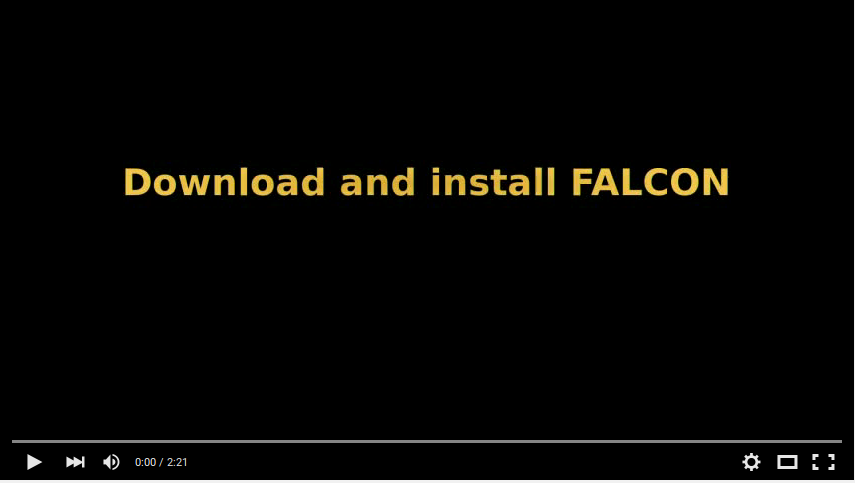

 

 

<b>FALCON is an alignment-free unsupervised machine learning system to detect pathogens in genomic and metagenomic samples</b>. Falcon looks for <b>similarity between any FASTA or FASTQ file</b>, independently from the size, <b>against any multi-FASTA database</b>, such as the entire viral and bacterial NCBI database (scripts are available for multiple databases downloads). 

As a <b>personalized medicine</b> example, FALCON can <b>detect the viral and bacterial genomes having similarity with a sequenced human genome</b> (for instance by NGS). Moreover, it can <b>run in a common laptop</b>.

The core of the method is based on the <b>relative algorithmic entropy</b>, a notion that uses model-freezing and exclusive information from a reference, allowing to use <b>much lower computational resources</b>. Moreover, it uses <b>variable multi-threading</b>, without multiplying the memory for each thread, being able to <b>run efficiently from a powerful server to a common laptop</b>.

To measure the similarity, the system will build <b>multiple finite-context models</b> that at the end of the reference sequence will be kept frozen. The target reads will then be measured using a mixture of the frozen models. The <b>mixture</b> estimates the probabilities assuming dependency from model performance, and thus, it will allow to adapt the usage of the models according to the nature of the target sequence. Furthermore, it uses <b>fault tolerant (substitution edits) finite-context models</b> that bridge the gap between context sizes.

The tool is also able to <b>identify locally where, in each database sequence, the similarity occur</b>. FALCON provides programs to <b>filter de local results (FALCON-FILTER)</b> and <b>to visualize the results (FALCON-EYE)</b>. <b>Several running modes</b> are available for different hardware and speed specifications. <b>The system is able to automatically learn to measure similarity</b>, whose properties are characteristics of the <b>Artificial Intelligence</b> field.

## INSTALLATION ##

Cmake is needed for installation (http://www.cmake.org/) for systems not using Linux. You can download it directly from http://www.cmake.org/cmake/resources/software.html or use an appropriate packet manager. In the following instructions we show the procedure to install FALCON:
<pre>
git clone https://github.com/pratas/falcon.git
cd falcon/src/
cmake .
make
cp FALCON ../../
cp FALCON-FILTER ../../
cp FALCON-EYE ../../
cd ../../
</pre>
Alternatively to git use wget:
<pre>
wget https://github.com/pratas/falcon/archive/master.zip
unzip master.zip
cd falcon-master/src
cmake .
make
cp FALCON ../../
cp FALCON-FILTER ../../
cp FALCON-EYE ../../
cd ../../
</pre>
or alternatively to cmake, for Linux, use the following:
<pre>
git clone https://github.com/pratas/falcon.git
cd falcon/src/
cp Makefile.linux Makefile
make
cp FALCON ../../
cp FALCON-FILTER ../../
cp FALCON-EYE ../../
cd ../../
</pre>
This will create three binary files:
<pre>
FALCON 
FALCON-FILTER
FALCON-EYE
</pre>
FALCON is the main program, FALCON-FILTER is used to filter local interactions and FALCON-EYE is used to visualize the output from FALCON-FILTER program.

## DEMO ##

After install, search for the top 10 similar virus in Chimpanzee chromosome 7:
<pre>

cp falcon/scripts/DownloadViruses.pl .
perl DownloadViruses.pl
wget  --trust-server-names -q \
ftp://ftp.ncbi.nlm.nih.gov/genomes/Pan_troglodytes/CHR_18/ptr_ref_Pan_troglodytes-2.1.4_chr18.fa.gz \
-O PT18.fa.gz
gunzip PT18.fa.gz
./FALCON -v -n 4 -c 20 -t 10 -l 15 PT18.fa viruses.fa
</pre>
It will use less than 3.5 GB of RAM memory and about 1 minute (in a common laptop) to run the FALCON.

In the case of problems with perl, run the following:
<pre>
perl -MCPAN -e'install "LWP::Simple"'
</pre>

## USAGE ##

To see the possible options of FALCON type
<pre>
./FALCON
</pre>
or
<pre>
./FALCON -h
</pre>
These will print the following options:
<pre>

Usage: FALCON [OPTION]... [FILE1] [FILE2]                                  
Machine learning system to detect pathogens in metagenomic samples.
                                                                         
Non-mandatory arguments:                                                 
                                                                         
  -h                       give this help,                               
  -F                       force mode (overwrites top file),
  -V                       display version number,                       
  -v                       verbose mode (more information),              
  -Z                       database local similarity,
  -s                       show compression levels,                       
  -l &#60level&#62               compression level [1;44],                     
  -p &#60sample&#62              subsampling (default: 1),                     
  -t &#60top&#62                 top of similarity (default: 20),                            
  -n &#60nThreads&#62            number of threads (default: 2),                            
  -x &#60FILE&#62                similarity top filename,                      
  -y &#60FILE&#62                local similarities filename,
                                                                         
Mandatory arguments:                                                     
                                                                         
  [FILE1]                  metagenomic filename (FASTA or FASTQ),              
  [FILE2]                  database filename (FASTA or Multi-FASTA).             
                                                                         
Report issues to &#60{pratas,ap,pjf,jmr}@ua.pt&#62.
</pre>
All the parameters can be better explained trough the following table:

| Parameters          | Meaning                                                     |
|---------------------|:------------------------------------------------------------|
| -h                  | It will print the parameters menu (help menu)                                        |
| -F                  | It will use the force mode, namely overwriting the output top file.                                        |
| -V                  | It will print the FALCON version number, license type and authors.    |
| -v                  | It will print progress information.    |
| -Z                  | It measures the local complexity to localize specific events. |
| -s                  | It will show pre-defined running levels/modes.    |
| -l &#60;level&#62;    | It will use the selected running levels/modes.    |
| -p &#60;sample&#62;   | If FALCON is using a single model it will sample (or use) only this periodic value of bases.    |
| -t &#60;top&#62;      | It will create a top with this size.              |
| -n &#60;nThreads&#62; | It will use multiple-threading. The time to accomplish the task will be much lower, without use more RAM memory.                   |
| -x &#60;FILE&#62;     | Output top filename. |
| -y &#60;FILE&#62;     | Output local similarities filename (profile). Only when -Z option is used. |
| [FILE1]           | The metagenomic filename (direct from the NGS sequencing platform). Possible file formats: FASTQ, multi-FASTA, FASTA or sequence [ACGTN]. |
| [FILE2]           | The database filename (e.g. virus or bacteria database). Possible file formats: FASTA, multi-FASTA or sequence [ACGTN]. There are several scripts, on directory scripts, to download several databases. |

### Local detection

<b>For local interactions detection and visualization</b> the package provides <b>FALCON-FILTER</b> and <b>FALCON-EYE</b>. 

#### Filtering

To see the possible options of FALCON-FILTER type
<pre>
./FALCON-FILTER
</pre>
or
<pre>
./FALCON-FILTER -h
</pre>
These will print the following options:
<pre>

Usage: FALCON-FILTER [OPTION]... [FILE]                                  
Filter and segment FALCON output.                                        
                                                                         
Non-mandatory arguments:                                                 
                                                                         
  -h                       give this help,                               
  -F                       force mode (overwrites top file),             
  -V                       display version number,                       
  -v                       verbose mode (more information),              
  -s  &#60size&#62               filter window size,                           
  -w  &#60type&#62               filter window type,                           
  -x  &#60sampling&#62           filter window sampling,                       
  -t  &#60threshold&#62          threshold,                                    
  -o  &#60FILE&#62               output filename,                              
                                                                         
Mandatory arguments:                                                     
                                                                         
  [FILE]                   profile filename (from FALCON),               
                                                                         
Report issues to &#60{pratas,ap,pjf,jmr}@ua.pt&#62.
</pre>
All the parameters can be better explained trough the following table:

| Parameters          | Meaning                                                     |
|---------------------|:------------------------------------------------------------|
| -h                  | It will print the parameters menu (help menu)                                        |
| -F                  | It will use the force mode, namely overwriting the output top file.                                        |
| -V                  | It will print the FALCON version number, license type and authors.    |
| -v                  | It will print progress information.    |
| -s &#60;size&#62;      | Filtering window size.              |
| -w &#60;type&#62;      | Window type [0;3]. Types: 0-Hamming, 1-Hann, 2-Blackman, 3-Rectangular.              |
| -x &#60;sampling&#62;      | Filtering window sampling (it will drop this number of bases).          |
| -t &#60;threshold&#62;      | Threshold to segment regions of similarity [0;2].              |
| -o &#60;FILE&#62;     | Output filename to be, for example, computed in FALCON-EYE. It contains the local positions with the intervals describing similarity. |
| [FILE]           | Profile filename given by the output of FALCON (option:-Z -y &#60;FILE&#62;). |

#### Visualization

To see the possible options of FALCON-EYE type
<pre>
./FALCON-EYE
</pre>
or
<pre>
./FALCON-EYE -h
</pre>
These will print the following options:
<pre>

Usage: FALCON-EYE [OPTION]... [FILE]                                     
Vizualise FALCON-FILTER output.                                                 
                                                                         
Non-mandatory arguments:                                                 
                                                                         
  -h                       give this help,                               
  -F                       force mode (overwrites top file),             
  -V                       display version number,                       
  -v                       verbose mode (more information),              
  -w  &#60width&#62              square width (for each value),                
  -s  &#60ispace&#62             square inter-space (between each value),      
  -i  &#60indexs&#62             color index start,                            
  -r  &#60indexr&#62             color index rotations,                        
  -u  &#60hue&#62                color hue,                                    
  -sl &#60lower&#62              similarity lower bound,                       
  -su &#60upper&#62              similarity upper bound,                       
  -dl &#60lower&#62              size lower bound,                             
  -du &#60upper&#62              size upper bound,                             
  -g  &#60color&#62              color gamma,                                  
  -e  &#60size&#62               enlarge painted regions,                      
  -ss                      do NOT show global scale,                     
  -sn                      do NOT show names,                            
  -o  &#60FILE&#62               output image filename,                        
                                                                         
Mandatory arguments:                                                     
                                                                         
  [FILE]                   profile filename (from FALCON-FILTER), 

Report issues to &#60{pratas,ap,pjf,jmr}@ua.pt&#62.
</pre>

All the parameters can be better explained trough the following table:

| Parameters          | Meaning                                                     |
|---------------------|:------------------------------------------------------------|
| -h                  | It will print the parameters menu (help menu)                                        |
| -F                  | It will use the force mode, namely overwriting the output top file.                                        |
| -V                  | It will print the FALCON version number, license type and authors.    |
| -v                  | It will print progress information.    |
| -w &#60;width&#62;      | square width.              |
| -s &#60;iSpace&#62;      | space between squares.              |
| -i &#60;indexs&#62;      | color index start.              |
| -r &#60;indexr&#62;      | color index rotations.              |
| -u &#60;hue&#62;      | color hue.              |
| -g &#60;color&#62;      | color gamma.              |
| -sl &#60;lower&#62;      | similarity lower bound.              |
| -su &#60;upper&#62;      | similarity upper bound.              |
| -dl &#60;lower&#62;      | size lower bound.              |
| -du &#60;upper&#62;      | size upper bound.              |
| -e &#60;size&#62;      | enlarge painter local regions.              |
| -ss                    | Does not show global scale.              |
| -sn                    | Does not show names.             |
| -o &#60;FILE&#62;     | Output SVG image filename. |
| [FILE]           | Profile filename given by the output of FALCON-FILTER. |

## COMMON USE ##

Create the following bash script:
<pre>
#!/bin/bash
./FALCON -v -n 4 -t 200 -F -Z -m 20:100:1:5/10 -c 30 -y complexity.com $1 $2
./FALCON-FILTER -v -F -t 0.5 -o positions.pos complexity.com
./FALCON-EYE -v -F -o draw.map positions.pos
</pre>
Name it Run.sh, then run it using:
<pre>
. Run.sh Eagle.fna virus.fna
</pre>
Eagle.fna and virus.fna are only two examples.
See folder examples for more.

## CITATION ##

On using this software/method please cite: 

D. Pratas, A. J. Pinho, P. J. S. G. Ferreira, J. M. O. S. Rodrigues (2015). FALCON: a machine learning system to detect pathogens in genomic and metagenomic samples. Zenodo. 10.5281/zenodo.35745.

D. Pratas, R. M. Silva, A. J. Pinho, P. J. S. G. Ferreira. An alignment-free method to find and visualise rearrangements between pairs of DNA sequences. Sci. Rep. 5, 10203; doi: 10.1038/srep10203 (2015).

## ISSUES ##

For any issue let us know at [issues link](https://github.com/pratas/falcon/issues).

## LICENSE ##

GPL v3.

For more information see LICENSE file or visit
<pre>http://www.gnu.org/licenses/gpl-3.0.html</pre>
