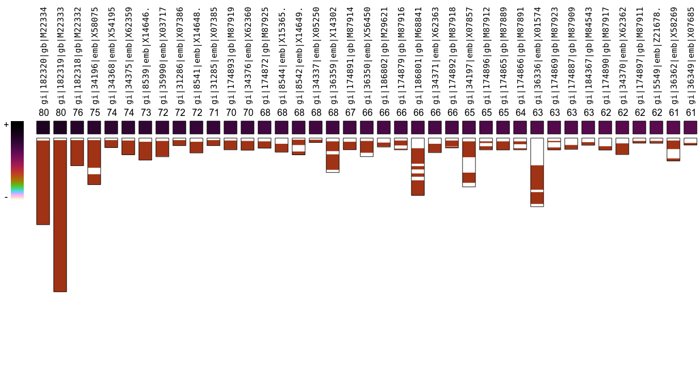

[](https://travis-ci.org/pratas/falcon)
[](LICENSE)
[](https://www.codacy.com/app/pratas/falcon?utm_source=github.com&amp;utm_medium=referral&amp;utm_content=pratas/falcon&amp;utm_campaign=Badge_Grade)

<p align="center"></p>

<p align="justify">
<b>FALCON is a method to infer metagenomic sample composition</b>. Falcon looks for <b>similarity between any FASTA or FASTQ file</b>, independently from the size, <b>against any multi-FASTA database</b>, such as the entire viral and bacterial NCBI database (scripts are available for multiple database downloads).</p>

<p align="justify">
As a <b>personalized medicine</b> example, FALCON can <b>detect the viral and bacterial genomes having similarity with a sequenced human genome</b> (for instance by NGS). Moreover, it can <b>run in a common laptop</b>.</p>

<p align="justify">
The core of the method is based on the estimation of <b>relative algorithmic information</b>, a notion that uses model-freezing and exclusive information from a reference, allowing to use <b>much lower computational resources</b>. Moreover, it uses <b>variable multi-threading</b>, without multiplying the memory for each thread, being able to <b>run efficiently from a powerful server to a common laptop</b>.</p>

<p align="justify">
To measure the similarity, the system will build <b>multiple finite-context models</b> that at the end of the reference sequence will be kept frozen. The target reads will, then, be measured using a mixture of the frozen models. The <b>mixture</b> estimates the probabilities assuming dependency from model performance, and thus, it will allow to adapt the usage of the models according to the nature of the target sequence. Furthermore, it uses <b>substitutional tolerant context models</b> and, hence, efficiently handle ancient DNA.</p>

<p align="justify">
The tool is also able to <b>identify locally where, in each database sequence, the similarity occur</b>. FALCON provides programs to <b>filter the local results (FALCON-FILTER)</b> and <b>to visualize the results (FALCON-EYE)</b>. <b>Several running modes</b> are available for different hardware and speed specifications. <b>The system is able to automatically learn to measure relative similarity</b>.
</p>

<p align="justify">
An example of the FALCON-EYE, program to visualize FALCON output, can be seen in the following figure:
</p>
<p align="center"></p>

<p align="justify">
An example of a viral reference database (FASTA) can be downloaded from <a href="http://sweet.ua.pt/pratas/datasets/VDB.fa.gz">here</a>. With this example, you only need to uncompress it, namely through: gunzip VDB.fa.gz, and use it in FALCON along with the FASTQ reads.
</p>
<br>

## 1. INSTALLATION ##

### A. First option: with [Conda](https://conda.io/miniconda)

```
conda install -c maxibor falcon
```

### B. Second option: manual installation  

[](https://www.youtube.com/watch?v=eLqXE2ghFNk)

Cmake is needed for installation (http://www.cmake.org/) for systems not using Linux. You can download it directly from (http://www.cmake.org/cmake/resources/software.html) or use an appropriate packet manager. In the following instructions we show the procedure to install FALCON:
<pre>
git clone https://github.com/pratas/falcon.git
cd falcon/src/
cmake .
make
cp FALCON ../../
cp FALCON-FILTER ../../
cp FALCON-EYE ../../
cd ../../
</pre>
Alternatively to git use wget:
<pre>
wget https://github.com/pratas/falcon/archive/master.zip
unzip master.zip
cd falcon-master/src
cmake .
make
cp FALCON ../../
cp FALCON-FILTER ../../
cp FALCON-EYE ../../
cd ../../
</pre>
or alternatively to cmake, for Linux, use the following:
<pre>
git clone https://github.com/pratas/falcon.git
cd falcon/src/
cp Makefile.linux Makefile
make
cp FALCON ../../
cp FALCON-FILTER ../../
cp FALCON-EYE ../../
cd ../../
</pre>
This will create three binary files:
<pre>
FALCON
FALCON-FILTER
FALCON-EYE
</pre>
FALCON is the main program, FALCON-FILTER is used to filter local interactions and FALCON-EYE is used to visualize the output from FALCON-FILTER program.

## 2. DEMO ##

After install, search for the top 10 similar virus in Chimpanzee chromosome 7:
<pre>
cp falcon/scripts/DownloadViruses.pl .
perl DownloadViruses.pl
wget  --trust-server-names -q \
ftp://ftp.ncbi.nlm.nih.gov/genomes/Pan_troglodytes/CHR_18/ptr_ref_Clint_PTRv2_chr18.fa.gz \
-O PT18.fa.gz
gunzip PT18.fa.gz
./FALCON -v -n 4 -c 20 -t 10 -l 15 PT18.fa viruses.fa
</pre>
It will use less than 3.5 GB of RAM memory and about 1 minute (in a common laptop) to run the FALCON.

In the case of problems with perl, run the following:
<pre>
perl -MCPAN -e'install "LWP::Simple"'
</pre>

## 3. USAGE ##

To see the possible options of FALCON type
<pre>
./FALCON
</pre>
or
<pre>
./FALCON -h
</pre>
These will print the following options:
```
Usage: FALCON [OPTION]... [FILE1] [FILE2]                                
A compression-based method to infer metagenomic sample composition.      
                                                                         
Non-mandatory arguments:                                                 
                                                                         
  -h                       give this help,                               
  -F                       force mode (overwrites top file),             
  -V                       display version number,                       
  -v                       verbose mode (more information),              
  -Z                       database local similarity,                    
  -s                       show compression levels,                      
  -l <level>               compression level [1;47],                    
  -p <sample>              subsampling (default: 1),                    
  -t <top>                 top of similarity (default: 20),              
  -n <nThreads>            number of threads (default: 2),              
  -x <FILE>                similarity top filename,                      
  -y <FILE>                local similarities filename,                  
                                                                         
Mandatory arguments:                                                     
                                                                         
  [FILE1]                  metagenomic filename (FASTA or FASTQ),        
  [FILE2]                  database filename (FASTA or Multi-FASTA).     
```

### 3.1 Local detection

<b>For local interactions detection and visualization</b> the package provides <b>FALCON-FILTER</b> and <b>FALCON-EYE</b>.

#### 3.1.1 Filtering

To see the possible options of FALCON-FILTER type
<pre>
./FALCON-FILTER
</pre>
or
<pre>
./FALCON-FILTER -h
</pre>
These will print the following options:

```
Usage: FALCON-FILTER [OPTION]... [FILE]                                  
Filter and segment FALCON output.                                        
                                                                         
Non-mandatory arguments:                                                 
                                                                         
  -h                       give this help,                               
  -F                       force mode (overwrites top file),             
  -V                       display version number,                       
  -v                       verbose mode (more information),              
  -s  <size>               filter window size,                           
  -w  <type>               filter window type,                           
  -x  <sampling>           filter window sampling,                       
  -sl <lower>              similarity lower bound,                       
  -su <upper>              similarity upper bound,                       
  -dl <lower>              size lower bound,                             
  -du <upper>              size upper bound,                             
  -t  <threshold>          threshold [0;2.0],                            
  -o  <FILE>               output filename,                              
                                                                         
Mandatory arguments:                                                     
                                                                         
  [FILE]                   profile filename (from FALCON).
```

#### 3.1.2 Visualization

To see the possible options of FALCON-EYE type
<pre>
./FALCON-EYE
</pre>
or
<pre>
./FALCON-EYE -h
</pre>
These will print the following options:

```
Usage: FALCON-EYE [OPTION]... [FILE]                                     
Visualize FALCON-FILTER output.                                          
                                                                         
Non-mandatory arguments:                                                 
                                                                         
  -h                       give this help,                               
  -F                       force mode (overwrites top file),             
  -V                       display version number,                       
  -v                       verbose mode (more information),              
  -w  <width>              square width (for each value),                
  -s  <ispace>             square inter-space (between each value),      
  -i  <indexs>             color index start,                            
  -r  <indexr>             color index rotations,                        
  -u  <hue>                color hue,                                    
  -sl <lower>              similarity lower bound,                       
  -su <upper>              similarity upper bound,                       
  -dl <lower>              size lower bound,                             
  -du <upper>              size upper bound,                             
  -bg                      show only the best of group,                  
  -g  <color>              color gamma,                                  
  -e  <size>               enlarge painted regions,                      
  -ss                      do NOT show global scale,                     
  -sn                      do NOT show names,                            
  -o  <FILE>               output image filename,                        
                                                                         
Mandatory arguments:                                                     
                                                                         
  [FILE]                   profile filename (from FALCON-FILTER).
```

## 4. COMMON USE ##

Create the following bash script:
<pre>
#!/bin/bash
./FALCON -v -n 4 -t 200 -F -Z -m 20:100:1:5/10 -c 30 -y complexity.com $1 $2
./FALCON-FILTER -v -F -t 0.5 -o positions.pos complexity.com
./FALCON-EYE -v -F -o draw.map positions.pos
</pre>
Name it Run.sh, then run it using:
<pre>
. Run.sh Eagle.fna virus.fna
</pre>
Eagle.fna and virus.fna are only two examples.
See folder examples for more.

## 5. CITATION ##

On using this software/method please cite:

D. Pratas, M. Hosseini, G. Grilo, A. J. Pinho, R. M. Silva, T. Caetano, J. Carneiro, F. Pereira. (2018). Metagenomic Composition Analysis of an Ancient Sequenced Polar Bear Jawbone from Svalbard. Genes, 9(9), 445.

D. Pratas, A. J. Pinho, R. M. Silva, J. M. O. S. Rodrigues, M. Hosseini, T. Caetano, P. J. S. G. Ferreira. FALCON-meta: a method to infer metagenomic composition of ancient DNA. BioRxiv preprint, 2018.

## 6. ISSUES ##

For any issue let us know at [issues link](https://github.com/pratas/falcon/issues).

## 7. LICENSE ##

GPL v3.

For more information see LICENSE file or visit
<pre>http://www.gnu.org/licenses/gpl-3.0.html</pre>
